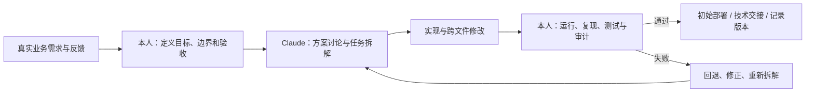

# AI 辅助开发说明

## 结论先行

本平台没有产品内 Agent 或 LLM 功能。AI 的作用发生在研发流程中：Claude Opus/Sonnet 曾辅助架构拆解、代码实现、错误定位、跨文件审计和开发日志交接。业务判断、方案取舍、代码整合、交付前测试、初始部署与技术交接由我负责；交付后的正式上线、生产数据运营和持续运维由社团负责。

## 实际协作方式

开发日志中最完整的一类证据是：先给出分任务实施方案、明确不得修改的边界和验收清单，再逐项实现、审计并记录交接。日志也保留了 AI 修改引发页面回归后由人工发现、回退和修复的案例。

## 本人的责任边界

- 判断社团提出的需求是否值得进入产品。
- 决定数据模型、角色、状态流和发布顺序。
- 选择、修改或拒绝 AI 给出的方案。
- 将多个文件的修改整合进可运行系统。
- 通过页面、API 和交付前部署环境验证结果。
- 对开发与交付阶段的个人信息、权限和技术风险负责，并明确交接后的责任边界。

因此更准确的项目角色是“唯一人类开发者 + AI 辅助研发”，而不是“没有使用任何工具独自手写所有代码”，也不是“多人开发团队”。

## 这段经历带来的认识

AI 降低了首次进入 Spring Boot、安全和部署等陌生领域的门槛，但不能自动保证跨文件一致性、权限正确性或产品合理性。高价值工作主要发生在：提供真实上下文、约束任务范围、识别错误、执行验证、保留决策记录，以及对本人负责的开发与交付范围承担结果。

这也是未来 Agent V2 的设计原则：先找到可评估的真实工作，再建立权限、人工确认、可追溯性与失败回退，而不是为了“加入 AI”而增加功能。
