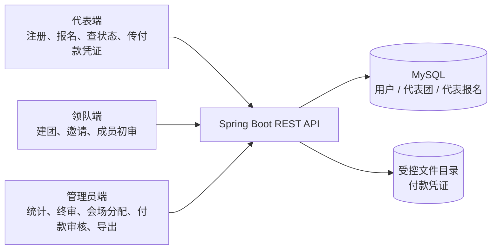
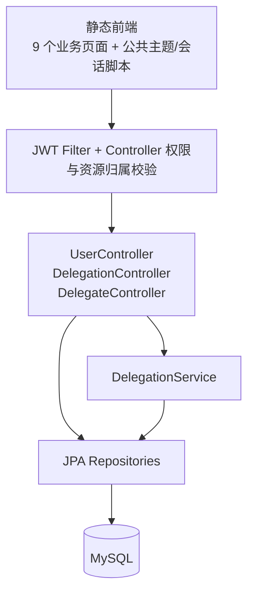
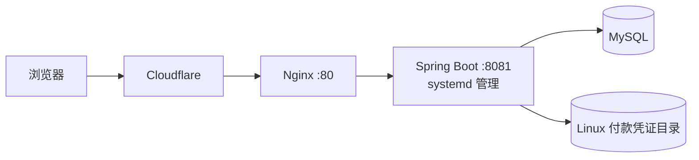

# 系统架构

## 业务闭环

三类前端都由同一个 Spring Boot 应用托管，并通过 REST API 访问中央数据源。数据更新后，其他角色在下一次加载或刷新时看到最新状态；系统没有 WebSocket 消息推送。

## 应用分层

这是一个模块化程度有限的 Spring Boot 单体：部署简单、适合首个项目和会议规模，但部分 Controller 与 HTML 文件过大，业务状态和展示逻辑存在耦合，是 V2 需要解决的技术债。

## 三个核心实体

- `User`：账号、BCrypt 密码哈希、角色与时间戳。
- `Delegation`：领队、代表团名称、学校、邀请码及联系方式。
- `Delegate`：代表资料、三志愿、调剂意愿、审核状态、会场、紧急联系人和付款状态。

核心关系为：一个领队用户管理一个代表团，一个代表团拥有多名代表；代表记录通过 `userId` 与个人账号关联，通过 `delegationId` 与代表团关联。

## 主要接口域

| 接口域 | 代表能力 |
| --- | --- |
| `/api/users` | 账号存在性检查、普通角色注册/登录、管理员纯登录、空账号撤销 |
| `/api/delegation` | 邀请码验证、建团、代表团查询、重名检查、管理员代表团视图 |
| `/api/delegate` | 报名、初审、个人/团队查询、管理员统计和终审、会场分配、付款凭证 |

当前快照约有 20 个 REST 路由。具体实现以 `controller/` 源码为准。

## 部署结构

历史开发日志能够证明完成过上述服务器部署并使服务保持 `active (running)`，但仓库缺少完整 Nginx/systemd 配置和数据库迁移文件，因此当前展示快照不能作为一键生产部署包。

## 数据安全边界

- 密码使用 BCrypt 哈希。
- JWT 承载 `userId` 和 `role`，后端不应信任客户端提交的操作者 ID。
- 管理接口校验管理员角色；个人和代表团资源按归属检查。
- 付款凭证限制大小与 MIME 类型，并通过受控接口读取。
- 展示仓库不包含真实报名记录、凭证图片或有效密钥。

当前 Spring Security 过滤链仍采用宽松入口、Controller 内手动鉴权，尚未完成统一策略化授权。这一点在 V2 路线中被列为优先改进项。
